# Epyon STIG Scanning Technical Reference

**Version**: 2.0  
**Last Updated**: 2026-08-12  
**Purpose**: Complete technical documentation for recreating Epyon's AI-powered STIG assessment engine

---

## Table of Contents

1. [Overview](#overview)
2. [Architecture](#architecture)
3. [STIG File Formats](#stig-file-formats)
4. [Technology Stack Detection](#technology-stack-detection)
5. [AI Assessment Engine](#ai-assessment-engine)
6. [Context Collection](#context-collection)
7. [Batching & Token Management](#batching--token-management)
8. [Freeze Logic & Status Validation](#freeze-logic--status-validation)
9. [ML Security Controls](#ml-security-controls)
10. [Output Formats](#output-formats)
11. [PR Automation](#pr-automation)
12. [Configuration](#configuration)
13. [Integration Points](#integration-points)
14. [Error Handling](#error-handling)
15. [Security Considerations](#security-considerations)

---

## Overview

Epyon's STIG scanning (Layer 13) performs AI-powered static compliance assessment against DISA STIG controls. The engine:

- **Automatically detects** which STIGs apply based on technology stack
- **Collects comprehensive context** from source code, security findings, suppression rules, and manual documentation
- **Batches controls efficiently** to maximize AI context window utilization
- **Validates status changes** between scans to prevent frivolous flips
- **Freezes high-confidence findings** to build trust in scan results
- **Generates human-readable reports** alongside machine-readable JSON
- **Automatically creates PRs** with findings in the target repository

### Key Innovation: Multi-Source Context Priority

Epyon's STIG assessment prioritizes **human-authored documentation** over automated analysis:

1. **Manual STIG documentation** (`docs/stig-findings.md`, `COMPLIANCE.md`) — **highest priority**
2. **Security findings** from current scan (CVEs, secrets, IaC issues)
3. **Risk acceptance rules** (`.epyon-ignore.yml` suppressions)
4. **Source code** (ranked by relevance to each control)

This ensures that human security assessors' judgments are preserved unless specific code changes invalidate them.

---

## Architecture

### Components

| Component | Path | Language | Purpose |
|-----------|------|----------|---------|
| **Main orchestrator** | `scripts/shell/run-stig-scan.sh` | Bash | Entry point, environment setup, STIG file discovery |
| **AI assessment engine** | `scripts/shell/run-stig-assessment.py` | Python | Core logic: context collection, AI calls, output generation |
| **STIG parser** | `scripts/shell/parse-stig-cklb.py` | Python | Parses .cklb JSON and XCCDF XML into unified format |
| **PR automation** | `scripts/shell/create-stig-pr.sh` | Bash | Creates/updates PR with findings in target repo |
| **STIG files** | `configuration/stigs/` | XML/JSON | DISA STIG control definitions |
| **ML checklist** | `configuration/stigs/ML-Security-Checklist.json` | JSON | ML-specific security controls (Layer 14/18/19/20 integration) |

### Data Flow

```mermaid
graph LR
    A[Target Repository] --> B[run-stig-scan.sh]
    B --> C[Collect Source Files]
    B --> D[Parse STIG Files]
    C --> E[run-stig-assessment.py]
    D --> E
    E --> F[Detect Technology Stack]
    F --> G[Filter Applicable STIGs]
    G --> H[Load Previous Results]
    H --> I[Freeze Stable Controls]
    I --> J[Batch Remaining Controls]
    J --> K[Build Context per Batch]
    K --> L[Call OpenAI API]
    L --> M[Validate Status Changes]
    M --> N[Write JSON + Markdown]
    N --> O[create-stig-pr.sh]
    O --> P[PR in Target Repo]
```



---

## STIG File Formats

### Supported Formats

Epyon parses two DISA STIG formats via `parse-stig-cklb.py`:

#### 1. CKLB JSON (Checklist format)

```json
{
  "title": "Application Name",
  "stigs": [
    {
      "stig_name": "Application Security and Development STIG",
      "version": "5.3",
      "release_info": "Release: 3 Benchmark Date: 26 Apr 2023",
      "rules": [
        {
          "rule_id": "SV-222387r960735_rule",
          "group_id": "V-222387",
          "rule_version": "APSC-DV-000010",
          "severity": "medium",
          "rule_title": "The application must limit the number of logon sessions per user.",
          "check_content": "Review the application documentation...",
          "fix_text": "Configure the application to limit...",
          "ccis": ["CCI-000054"]
        }
      ]
    }
  ]
}
```

#### 2. XCCDF XML (Benchmark format)

```xml
<Benchmark xmlns="http://checklists.nist.gov/xccdf/1.2">
  <title>Application Security and Development Security Technical Implementation Guide</title>
  <version>5</version>
  <Group id="V-222387">
    <Rule id="SV-222387r960735_rule" severity="medium">
      <version>APSC-DV-000010</version>
      <title>The application must limit the number of logon sessions per user.</title>
      <check>
        <check-content>Review the application documentation...</check-content>
      </check>
      <fixtext>Configure the application to limit...</fixtext>
      <ident system="http://cyber.mil/cci">CCI-000054</ident>
    </Rule>
  </Group>
</Benchmark>
```

### Unified Internal Format

Both formats are parsed into:

```python
{
    "stig_name": str,
    "version": str,
    "release_info": str,
    "stig_id": str,  # UUID
    "controls": [
        {
            "number": int,          # Sequential number
            "vuln_id": str,         # APSC-DV-XXXXXX (primary key)
            "rule_id": str,         # SV-XXXXXX...
            "group_id": str,        # V-XXXXXX
            "severity": str,        # "high" | "medium" | "low"
            "title": str,
            "check_content": str,   # What to verify
            "fix_text": str,        # How to remediate
            "discussion": str,
            "ccis": List[str],      # CCI references
            "srg_id": str          # SRG reference
        }
    ]
}
```

---

## Technology Stack Detection

**Purpose**: Only run STIGs that are applicable to the application's technology stack.

### Detection Logic (`detect_technologies()`)

```python
def detect_technologies(files: List[Tuple[str, str]]) -> Dict[str, Any]:
    """
    Scans source files for technology signals and returns:
    {
        "databases": ["postgresql", "mysql", ...],
        "app_servers": ["tomcat", "jetty", ...],
        "frameworks": ["dotnet", "spring", ...],
        "languages": ["python", "java", ...],
        "has_web_ui": bool
    }
    """
```

### Detection Patterns

| Technology | Signals |
|------------|---------|
| **PostgreSQL** | `postgresql`, `postgres`, `psycopg`, `pg_`, `libpq`, `pgcrypto` |
| **MySQL** | `mysql`, `mariadb`, `pymysql`, `mysql-connector`, `jdbc:mysql` |
| **MongoDB** | `mongodb`, `mongoose`, `pymongo`, `mongo` |
| **Oracle** | `oracle`, `oracledb`, `cx_oracle`, `jdbc:oracle` |
| **Tomcat** | `tomcat`, `catalina`, `org.apache.tomcat`, `servlet-api` |
| **Jetty** | `jetty`, `org.eclipse.jetty` |
| **.NET** | `.csproj`, `.vbproj`, `Microsoft.`, `System.`, `netcoreapp` |
| **Spring** | `springframework`, `spring-boot`, `spring-web` |
| **Django** | `django`, `from django`, `import django` |

### Applicability Rules (`is_stig_applicable()`)

```python
# Example: PostgreSQL STIG only runs if PostgreSQL detected
if "postgres" in filename_lower:
    if "postgresql" in tech_stack["databases"]:
        return (True, "PostgreSQL detected in codebase")
    return (False, "PostgreSQL STIG not applicable - no PostgreSQL detected")

# ASD (Application Security Development) STIG ALWAYS runs
if "u_asd_stig" in filename_lower:
    return (True, "ASD STIG applies to all applications")
```

### Automatic STIG Discovery

**Any `.cklb` or `.xml` file in `configuration/stigs/` is automatically picked up** and filtered based on applicability.

To add a new STIG:
1. Drop the file into `configuration/stigs/`
2. No code changes needed — it's detected automatically
3. Applicability logic filters it based on tech stack

---

## AI Assessment Engine

### OpenAI Configuration

```python
# Environment variables
OPENAI_API_KEY = os.environ["OPENAI_API_KEY"]      # Required (or set to 'local' for self-hosted)
OPENAI_MODEL = os.environ.get("OPENAI_MODEL", "gpt-4o-mini")
OPENAI_BASE_URL = os.environ.get("OPENAI_BASE_URL", "")  # Optional: override for self-hosted models

# SSRF protection: only allow OpenAI public hosts, localhost, or allowlisted hosts
_OPENAI_PUBLIC_HOSTS = {"api.openai.com", "openai.azure.com"}

def _base_url_allowed(base_url: str) -> bool:
    """Block public non-OpenAI endpoints to prevent credential exfiltration"""
    host = _hostname(base_url)
    if host in _OPENAI_PUBLIC_HOSTS or _is_internal_host(host):
        return True
    allow = os.environ.get("EPYON_AI_ALLOWED_HOSTS", "")
    return host in {h.strip().lower() for h in allow.split(",") if h.strip()}
```

### System Prompt Architecture

The system prompt is **1,500 words** and includes:

1. **Role definition**: "You are a certified DISA STIG compliance analyst"
2. **Assessment methodology** (6 steps):
   - STEP 1: Read check_content and identify technical requirement
   - STEP 2: Search every provided file for evidence
   - STEP 3: Extract exact literals (quote actual code)
   - STEP 4: Cross-reference against requirement
   - STEP 5: CONFIRM or UPDATE using previous finding
3. **Status definitions**:
   - `Not a Finding`: Specific artifacts directly satisfy the control (file path + exact value)
   - `Not Applicable`: Architecturally impossible (state specific reason)
   - `Open`: **DEFAULT** — compliance cannot be fully confirmed (use when in doubt)
   - `Not Reviewed`: RESERVED for 100% runtime-only controls with zero static indicators
4. **Evidence format requirements**:
   - Start with one-sentence summary
   - Use bullet points for each piece of evidence
   - Every code reference MUST include: file path, setting name, literal value
   - Compare values to standards/thresholds explicitly
   - End with "- Requirement: SATISFIED/NOT SATISFIED — [reason]"
5. **Response format**: JSON array only, no markdown fences

### Key Prompt Engineering Decisions

- **Status validation**: Previous status + evidence are sent with each control. The AI must either CONFIRM (with potentially refreshed evidence wording) or UPDATE (with specific file changes cited).
- **Default to Open**: Instructs the AI to use `Open` as the **safe default** when compliance cannot be demonstrated from static artifacts alone. This prevents false satisfaction.
- **Literal value extraction**: Emphasizes quoting actual code values (e.g., `SESSION_TIMEOUT = 900`) rather than paraphrasing.
- **Manual documentation priority**: Instructs AI to defer to human-authored STIG assessments unless code changes invalidate them.

---

## Context Collection

### Source File Collection (`collect_source_files()`)

#### Inclusion Rules

```python
SOURCE_EXTENSIONS = {
    # Application code
    ".py", ".ts", ".tsx", ".js", ".jsx", ".go", ".java", ".rb", ".cs",
    ".rs", ".kt", ".kts", ".php", ".vue", ".svelte",
    # Shell/scripting
    ".sh", ".bash", ".zsh",
    # Config/markup
    ".yml", ".yaml", ".json", ".toml", ".cfg", ".ini", ".properties", ".conf", ".xml",
    # IaC/build
    ".tf", ".hcl", ".gradle",
    # Templates
    ".html", ".htm", ".jinja2", ".j2", ".tpl",
    # Database
    ".sql",
    # Documentation
    ".md",  # Only if compliance-relevant (see below)
}

INCLUDE_FILENAMES = {
    "Dockerfile", "docker-compose.yml", "Makefile", "justfile",
    "nginx.conf", "httpd.conf", "web.xml", "pom.xml", "build.gradle",
}
```

#### Exclusion Rules

```python
EXCLUDE_DIR_PREFIXES = {
    ".git", "node_modules", "__pycache__", ".venv", "venv", "env",
    "dist", "build", "coverage", ".pytest_cache", "*.egg-info",
}

_ALLOWED_HIDDEN_DIRS = {
    ".github", ".circleci", ".drone", ".gitlab",
    ".devcontainer", ".helm",
}

# Never send actual .env files (may contain live secrets)
if name == ".env" or (name.startswith(".env.") and name not in {".env.example", ".env.template"}):
    continue
```

#### Markdown/JSON Filtering

**Only compliance-relevant markdown/JSON files are collected** (to avoid context overflow):

```python
_COMPLIANCE_DOCS = {
    "readme", "security", "compliance", "stig", "findings", 
    "audit", "controls", "assessment", "ato", "isso",
    "vulnerabilities", "cve", "changelog", "contributing",
}

def _is_compliance_relevant_doc(path: Path) -> bool:
    """
    Priority files:
    - docs/stig-findings.md, docs/security/stig-findings.md
    - COMPLIANCE.md, STIG.md, SECURITY.md
    - Any file in docs/, documentation/, .github/, security/
    - Files with compliance keywords
    """
    ext = path.suffix.lower()
    if ext not in {".md", ".json"}:
        return False
    
    # Allow any markdown/JSON in compliance directories
    if any(part in {".github", "docs", "documentation", ".compliance", "security"} 
           for part in path.parts):
        return True
    
    # Check filename stem for compliance keywords
    stem_lower = path.stem.lower()
    for keyword in _COMPLIANCE_DOCS:
        if keyword in stem_lower:
            return True
    
    return False
```

### Manual STIG Documentation Extraction

**Key innovation**: Separate human-authored STIG assessments from source code and present them with **priority context**.

```python
def extract_manual_stig_docs(files: List[Tuple[str, str]]) -> Tuple[List, List]:
    """
    Returns (manual_docs, remaining_files)
    
    Manual docs are identified by:
    - Path contains: docs/, documentation/, .github/, .compliance/, security/
    - Filename: stig-findings.md, findings.md, COMPLIANCE.md, STIG.md, SECURITY.md
    - Filename contains: stig, findings, compliance, audit, controls, assessment
    """
```

These files are presented to the AI in a **separate priority section BEFORE source code**:

```python
if manual_stig_docs:
    manual_docs_section = (
        "━━━━━━━━━━━━━━━━━━━━━━━━━━━━━━━━━━━━━━━━━━━━━━━━━━━━━━━━━━━━━━━━━━\n"
        "MANUAL STIG DOCUMENTATION (PRIORITY — DEFER TO THESE ASSESSMENTS)\n"
        "━━━━━━━━━━━━━━━━━━━━━━━━━━━━━━━━━━━━━━━━━━━━━━━━━━━━━━━━━━━━━━━━━━\n"
        "\n"
        "The following files contain human-authored STIG assessments, manual overrides,\n"
        "compliance notes, and verified evidence. THESE TAKE ABSOLUTE PRIORITY.\n"
        "\n"
        "DO NOT override these manual assessments unless you find SPECIFIC CODE CHANGES\n"
        "that materially invalidate the documented assessment.\n"
        f"{manual_stig_docs}\n"
        "━━━━━━━━━━━━━━━━━━━━━━━━━━━━━━━━━━━━━━━━━━━━━━━━━━━━━━━━━━━━━━━━━━\n"
    )
```

### Security Findings Context

```python
def collect_security_findings(scan_dir: Path, max_findings: int = 3) -> str:
    """
    Loads security-findings-summary.json from current scan.
    
    Returns formatted string with:
    - Summary counts (critical/high/medium/low)
    - Tools analyzed (Grype, Trivy, TruffleHog, etc.)
    - Top 3 critical and high findings
    - CISA KEV count if present
    """
```

Example output:

```
SECURITY SCAN FINDINGS (Current Scan):
Critical: 2, High: 15, Medium: 43, Low: 12
Tools: grype, trivy, trufflehog, checkov, anchore

Critical (top 3):
  [grype] CVE-2024-12345 in libssl1.1
  [trivy] CVE-2024-67890 in numpy

⚠️ 1 CISA KEV findings
```

### Suppression Rules Context

```python
def collect_suppression_rules(target_dir: str, max_rules: int = 10) -> str:
    """
    Loads .epyon-ignore.yml from target repository.
    
    Returns formatted string showing accepted risks and justifications.
    """
```

Example output:

```
RISK ACCEPTANCE / SUPPRESSION RULES (5 total):

1. cve: CVE-2023-12345
   Reason: False positive - vulnerable code path not used (approved: john.smith@example.com)
2. package: old-legacy-lib
   Reason: Required for compatibility, isolated in sandbox (approved: security-team@example.com)
```

### File Ranking by Relevance

```python
def extract_keywords(check_content: str) -> List[str]:
    """
    Extract meaningful keywords from STIG check_content.
    - Strip stopwords ("the", "and", "application", "must", etc.)
    - Return top 30 meaningful terms
    """

def rank_files_by_relevance(files: List[Tuple[str, str]], keywords: List[str]) -> List[Tuple[str, str]]:
    """
    Sort files by keyword hit count (descending).
    Files with more keyword matches appear first in context.
    """
```

### Repository Manifest

```python
def build_repo_manifest(files: List[Tuple[str, str]]) -> str:
    """
    Build a compact file tree listing (capped at 150 paths).
    
    Sent with EVERY batch so the AI always knows the full file tree
    even if some files exceed context budget.
    """
```

Example output:

```
Repository file manifest (selected files):

  .github/workflows/ci.yml
  Dockerfile
  README.md
  src/main.py
  src/auth/login.py
  ...
  tests/test_auth.py

  [... 42 additional file(s) omitted from manifest to stay within context budget]
```

---

## Batching & Token Management

### Context Budget

```python
MAX_CODE_BYTES_PER_BATCH = 60_000   # 60 KB ≈ 20-30k tokens (safe for 128K context models)
MAX_FILE_BYTES = 25_000             # Truncate (not skip) files larger than 25 KB
_MAX_MANIFEST_LINES = 150           # Cap repo manifest to 150 paths
BATCH_SIZE_DEFAULT = 5              # Controls per API call
```

**Token estimation**: OpenAI's cl100k_base tokenizer produces ~1 token per 2-3 bytes for dense code. 60 KB of code ≈ 20k-30k tokens, leaving room for system prompt, manifest, and security findings within gpt-4o-mini's 128K context window.

### Per-Control Guaranteed Files

**Problem**: With the naive combined-keyword approach, files relevant to only one control get crowded out by files relevant to many controls.

**Solution**: Each control is **guaranteed** its top-N most-relevant files before global budget filling.

```python
_GUARANTEED_FILES_PER_CONTROL = 3  # Each control gets its top 3 files guaranteed

def build_code_context_for_batch(
    files: List[Tuple[str, str]],
    controls_batch: List[Dict[str, Any]],
    max_bytes: int = MAX_CODE_BYTES_PER_BATCH,
) -> str:
    """
    Build code context with per-control guaranteed files.
    
    Algorithm:
    1. For each control, extract keywords (including vuln_id itself)
    2. Rank files by that control's keywords alone
    3. Mark the top 3 files as "guaranteed" for that control
    4. Fill remaining budget with globally-ranked files (combined keywords)
    5. Deduplicate — each file appears only once
    
    Result: Every control gets at least some of its most relevant files,
    even when sharing a batch with other controls.
    """
```

### Context Overflow Retry Logic

```python
_MAX_BATCH_RETRIES = 3

# Attempt 1: Full code budget + manifest
# Attempt 2: Halved code budget + manifest (if context_length_exceeded)
# Attempt 3: Halved code budget, NO manifest (last resort)
```

If all attempts fail, controls are marked `Open` with confidence 0.

---

## Freeze Logic & Status Validation

### Freeze Stable Controls

**Purpose**: Build trust in scan results by preserving high-confidence closed controls across runs.

```python
_FREEZE_STATUSES = {"Not a Finding", "Not Applicable"}
_FREEZE_MIN_CONF = 85

frozen_assessments = {}
controls_to_assess = []

for control in controls:
    vuln_id = control["vuln_id"]
    prev = previous_assessments.get(vuln_id, {})
    prev_status = prev.get("status")
    prev_conf = prev.get("confidence", 0)
    
    if prev_status in _FREEZE_STATUSES and prev_conf >= _FREEZE_MIN_CONF:
        # Freeze: carry forward unchanged
        frozen_assessments[vuln_id] = prev
    else:
        # Re-assess: Open or Not Reviewed, or low confidence
        controls_to_assess.append(control)
```

**Frozen controls** are **never sent to the AI** — they are carried forward directly to the output.

### Status Change Validation

**Purpose**: Prevent frivolous status changes between scans. AI must cite specific file changes to justify a status change.

```python
# Previous status + evidence are sent with each control in the batch
controls_json = [
    {
        "vuln_id": c["vuln_id"],
        "title": c["title"],
        "check_content": c["check_content"],
        "fix_text": c["fix_text"],
        "previous_status": previous_assessments.get(c["vuln_id"], {}).get("status"),
        "previous_evidence": previous_assessments.get(c["vuln_id"], {}).get("evidence"),
    }
    for c in controls_batch
]
```

The AI's **STEP 5** in the system prompt:

> **STEP 5 — CONFIRM or UPDATE using the previous finding:**
>
> IF previous_status is present:
> 1. Re-read the previous_evidence. Locate the exact files and values it cites.
> 2. If those artifacts STILL EXIST and STILL SATISFY → **CONFIRM**: output the same status. You may refresh evidence wording, but do not change status.
> 3. If artifacts have CHANGED, DISAPPEARED, or NEW artifacts materially alter compliance → **UPDATE**: output new status with fully re-cited evidence.
> 4. If you cannot find any previously cited files/values → treat as fresh assessment.
>
> **KEY RULE**: A status change MUST be backed by a specific file path and literal value that differs from what the previous_evidence cited. Rephrasing, vague observations, or "further review needed" are NOT acceptable reasons to change status.

### Confidence Threshold for Closed Statuses

```python
_MIN_CONFIDENCE_FOR_CLOSED_STATUS = 40

def normalize_status(raw: str | None) -> str:
    """
    Falls back to 'Open' if value cannot be recognized.
    Never stores invalid status that would break freeze logic or UI rendering.
    """
    if raw is None:
        return "Open"
    if raw in VALID_STATUSES:
        return raw
    candidate = _STATUS_ALIASES.get(raw.strip().lower())
    return candidate if candidate else "Open"

# After parsing AI response:
if status in {"Not a Finding", "Not Applicable"} and confidence < _MIN_CONFIDENCE_FOR_CLOSED_STATUS:
    # Downgrade untrustworthy closed status to Open
    status = "Open"
```

---

## ML Security Controls

**Layer 13 extension**: Rule-based assessment of ML-specific controls using findings from Layers 14/18/19/20.

### ML Checklist Format

`configuration/stigs/ML-Security-Checklist.json`:

```json
{
  "title": "ML/AI Security Controls",
  "version": "1.0",
  "release_date": "2026-07-30",
  "description": "STIG controls for Machine Learning and AI systems.",
  "controls": [
    {
      "id": "ML-001",
      "title": "Model File Integrity - Dangerous Imports",
      "severity": "high",
      "category": "Model Security",
      "description": "ML model files must not contain dangerous imports...",
      "check_text": "Verify that all ML model files have been scanned...",
      "fix_text": "Remove or replace model files containing dangerous imports...",
      "status_guidance": {
        "not_a_finding": "No model files contain dangerous imports.",
        "open": "One or more model files contain dangerous imports.",
        "not_applicable": "Application does not use ML models."
      }
    }
  ]
}
```

### ML Control Assessment Logic

```python
def assess_ml_controls(scan_dir: Path, app_name: str, scan_date: str, target_dir: str) -> None:
    """
    Rule-based assessment (no AI calls).
    
    Reads findings from:
    - Layer 14: picklescan/picklescan-results.json
    - Layer 18: model-provenance/model-provenance-results.json
    - Layer 19: inference-security/inference-security-results.json
    - Layer 20: ml-runtime/ml-runtime-analysis-results.json
    
    For each control, checks findings and assigns status + evidence + confidence.
    """

def _assess_ml_control(
    control: Dict[str, Any],
    layer14: Dict[str, Any],
    layer18: Dict[str, Any],
    layer19: Dict[str, Any],
    layer20: Dict[str, Any],
) -> Dict[str, Any]:
    """
    Example: ML-001 (Dangerous Imports)
    
    if control_id == "ML-001":
        findings = layer14.get("findings", [])
        dangerous = [f for f in findings if f.get("type") == "dangerous_imports"]
        
        if dangerous:
            return {
                "status": "Open",
                "evidence": f"Found {len(dangerous)} model files with dangerous imports: ...",
                "confidence": 95
            }
        else:
            return {
                "status": "Not a Finding",
                "evidence": "No dangerous imports detected in model files.",
                "confidence": 90
            }
    """
```

### ML Control Categories

| Category | Controls | Layer Dependencies |
|----------|----------|-------------------|
| **Model Security** | ML-001 to ML-004 | Layer 14 (picklescan) |
| **Supply Chain Security** | ML-005 to ML-008 | Layer 18 (model-provenance) |
| **Inference Environment** | ML-009 to ML-012 | Layer 19 (inference-security) |
| **Runtime Behavior** | ML-013 to ML-015 | Layer 20 (ml-runtime) |

### ML Assessment Output

```python
# Written to scan directory:
results_path = scan_dir / "stig-results-ml.json"
findings_path = scan_dir / f"findings-{app_name}-ml.md"

results_data = {
    "stig_name": "ML/AI Security Controls",
    "stig_version": "1.0",
    "scan_date": scan_date,
    "app_name": app_name,
    "assessments": {
        "ML-001": {"status": "Not a Finding", "evidence": "...", "confidence": 90},
        ...
    },
    "token_usage": {
        "total_prompt_tokens": 0,
        "total_completion_tokens": 0,
        "note": "ML controls assessed via rule-based analysis, no AI tokens used"
    }
}
```

---

## Output Formats

### Per-STIG Output Files

For each assessed STIG, Epyon writes:

```bash
$SCAN_DIR/
  stig-controls-{slug}.json      # Parsed controls (input to assessment)
  stig-results-{slug}.json       # Assessment results (machine-readable)
  findings-{app}-{slug}.md       # Human-readable findings report
  findings-{app}-{slug}.cklb     # CKLB format (for STIG Viewer import)
```

Where `{slug}` is derived from the STIG filename (e.g., `u-asd-stig-v6r4-manual-xccdf` → `u-asd-stig-v6r4-manual-xccdf`).

### Primary Report

The **first applicable STIG** is designated "primary" and gets a simplified filename:

```bash
$SCAN_DIR/
  findings-{app}.md              # Primary STIG findings (symlink or copy)
```

### JSON Output Schema

`stig-results-{slug}.json`:

```json
{
  "stig_name": "Application Security and Development STIG",
  "stig_version": "5.3",
  "scan_date": "2026-08-12",
  "app_name": "myapp",
  "assessments": {
    "APSC-DV-000010": {
      "status": "Not Applicable",
      "evidence": "Epyon is a CLI-based DevSecOps pipeline tool with no user authentication layer...",
      "confidence": 95
    },
    "APSC-DV-000110": {
      "status": "Open",
      "evidence": "Static repository analysis completed. Control-specific implementation evidence was not fully demonstrably satisfied from repository artifacts alone...",
      "confidence": 40
    }
  },
  "token_usage": {
    "total_prompt_tokens": 123456,
    "total_completion_tokens": 45678,
    "cost_estimate_usd": 0.85
  },
  "scan_metadata": {
    "frozen_controls": 128,
    "assessed_controls": 158,
    "total_controls": 286,
    "previous_scan_dir": "myapp_2026-08-01_12-00-00"
  }
}
```

### Markdown Output Format

`findings-{app}-{slug}.md`:

```markdown
# myapp STIG Findings Assessment

Total STIGs Assessed: 286

| Status | Count |
|---|---|
| Not Applicable | 128 |
| Not a Finding | 88 |
| Open | 70 |

### 1. APSC-DV-000010 | SV-222387r960735

- Rule ID: SV-222387r960735
- Severity: medium
- Rule Title: The application must provide a capability to limit the number of logon sessions per user.

Status: Not Applicable
Confidence: 95/100

Evidence:
- Static repository analysis completed on 2026-08-12.
- Epyon is a CLI-based DevSecOps pipeline tool with no user authentication layer, no session management, no user accounts, no login/logoff mechanism, and no web interface.
- This control requires an application authentication/session construct that does not exist in Epyon.

Remediation:
N/A

---
```

### CKLB Output

```python
def render_findings_cklb(
    app_name: str,
    stig_data: Dict[str, Any],
    assessments: Dict[str, Dict[str, str]],
    scan_date: str,
) -> Dict[str, Any]:
    """
    Build CKLB-compatible JSON for import into STIG Viewer.
    
    Maps statuses:
      "Not a Finding"  → "not_a_finding"
      "Not Applicable" → "not_applicable"
      "Open"           → "open"
      "Not Reviewed"   → "not_reviewed"
    """
```

---

## PR Automation

**Script**: `scripts/shell/create-stig-pr.sh`

### Workflow

1. **Locate findings file** (`findings-{app}.md` or `findings-{app}-{slug}.md`)
2. **Copy to target repo root** as `stig-findings.md`
3. **Create branch** `stig-update-YYYY-MM-DD`
4. **Commit** with message: `chore: update STIG compliance findings (scan YYYY-MM-DD)`
5. **Push branch** to remote
6. **Create/update PR** with body:

```markdown
## STIG Compliance Assessment Update

📊 **Scan Date**: 2026-08-12  
🔐 **STIG**: Application Security and Development STIG V5R3  

### Summary

| Status | Count |
|--------|-------|
| ✅ Not a Finding | 88 |
| ⚠️ Open | 70 |
| 🚫 Not Applicable | 128 |

### Review Instructions

1. Review the updated `stig-findings.md` file
2. Verify evidence for any status changes from previous scan
3. Document any manual overrides in `docs/stig-findings.md`
4. Approve and merge when satisfied

---
*Generated by Epyon Security Scanner (Layer 13: STIG Compliance)*
```

### Environment Variables

```bash
GITHUB_TOKEN or GH_PAT    # Required for PR creation
SKIP_STIG_PR=true         # Disable PR automation entirely
```

### Soft Failure

If `GITHUB_TOKEN` is not set or target is not a Git repo, the script **exits 0 (success)** — PR automation is optional and never blocks the scan.

---

## Configuration

### Environment Variables

| Variable | Required | Default | Purpose |
|----------|----------|---------|---------|
| `OPENAI_API_KEY` | Yes* | — | OpenAI API key (*or set to 'local' for self-hosted) |
| `OPENAI_MODEL` | No | `gpt-4o-mini` | Model name |
| `OPENAI_BASE_URL` | No | — | Override API endpoint (for self-hosted models) |
| `EPYON_AI_ALLOWED_HOSTS` | No | — | Comma-separated hostnames allowed for self-hosted endpoints (SSRF protection) |
| `STIGS_DIR` | No | `configuration/stigs` | Directory containing STIG files |
| `STIGS_FILE` | No | — | Single STIG file path (overrides STIGS_DIR) |
| `SCAN_DIR` | No | Auto-derived | Output directory for scan results |
| `APP_NAME` | No | `basename(TARGET_DIR)` | Application name for reports |
| `BATCH_SIZE` | No | `5` | Controls per API call |
| `BATCH_DELAY` | No | `1` | Seconds between API calls |
| `SKIP_STIG` | No | `false` | Skip STIG assessment entirely |
| `SKIP_STIG_PR` | No | `false` | Skip PR automation |
| `GITHUB_TOKEN` | No* | — | GitHub token for PR creation (*required for PR automation) |
| `GH_PAT` | No | — | Fallback for `GITHUB_TOKEN` |

### Self-Hosted Models

```bash
# Ollama
export OPENAI_BASE_URL="http://localhost:11434/v1"
export OPENAI_API_KEY="local"  # Any non-empty string
export OPENAI_MODEL="llama3:70b"

# LM Studio
export OPENAI_BASE_URL="http://localhost:1234/v1"
export OPENAI_API_KEY="local"

# vLLM
export OPENAI_BASE_URL="http://localhost:8000/v1"
export OPENAI_API_KEY="local"
```

**SSRF Protection**: Self-hosted URLs must resolve to:
- `localhost` / `127.0.0.1` / `::1`
- Private IP addresses (RFC1918)
- Cluster-internal names (`.svc`, `.svc.cluster.local`)
- Hostnames in `EPYON_AI_ALLOWED_HOSTS`

Public non-OpenAI endpoints are **blocked** to prevent credential exfiltration.

---

## Integration Points

### Upstream Integrations (Inputs)

1. **Target repository** → Source files, configs, documentation
2. **Security findings** → `security-findings-summary.json` (from consolidate-security-reports.sh)
3. **Suppression rules** → `.epyon-ignore.yml` (from target repo)
4. **Manual STIG docs** → `docs/stig-findings.md`, `COMPLIANCE.md`, etc. (from target repo)
5. **ML security findings** → Layer 14/18/19/20 JSON outputs (from scan directory)
6. **Previous scan results** → `scans/{app}_*/stig-results-{slug}.json` (from sibling scan directories)

### Downstream Integrations (Outputs)

1. **Web UI** → Parses `stig-results-{slug}.json` via `parsers.py::parse_stig_dirs()`
2. **Dashboard HTML** → Embeds STIG status counts in `<!-- __EPYON_METRICS__ -->` section
3. **GitHub Issues/Jira** → Can sync STIG findings as tickets (tracked by `vuln_id`)
4. **STIG Viewer** → Imports `.cklb` files for visual review
5. **Target repo PR** → `stig-findings.md` via `create-stig-pr.sh`
6. **Executive summary** → AI-generated summaries reference STIG compliance status

---

## Error Handling

### Token Overflow

```python
try:
    results, prompt_tokens, completion_tokens = call_openai(...)
except openai.RateLimitError:
    time.sleep(delay * 2)  # Exponential backoff
    continue
except openai.APIError as e:
    if "context_length_exceeded" in str(e):
        # Retry with halved code budget
        max_bytes_for_retry = max_bytes // 2
        ...
```

### Invalid AI Response

```python
try:
    parsed = json.loads(raw)
except json.JSONDecodeError:
    # Log error, fall back to Open status with confidence 0
    for c in controls_batch:
        assessments[c["vuln_id"]] = {
            "status": "Open",
            "evidence": "AI response parsing failed - manual review required",
            "confidence": 0
        }
```

### Missing Previous Scan Results

```python
previous_scan_dir = find_previous_scan_dir(scan_dir, app_name)
if not previous_scan_dir:
    print("[INFO] No previous scan found — all controls assessed fresh")
    previous_assessments = {}
else:
    previous_assessments = load_previous_stig_results(previous_scan_dir, slug)
```

### Applicability Check Failure

```python
try:
    applicable, reason, pt, ct = check_stig_applicability(client, model, stig_data, app_profile)
except Exception as exc:
    # Fail open: if check fails, assume STIG is applicable
    applicable, reason = True, f"Applicability check failed ({exc}) — proceeding with assessment"
```

---

## Security Considerations

### 1. API Key Protection

- **Never log** `OPENAI_API_KEY` in output or error messages
- **SSRF guard** prevents key exfiltration to attacker-controlled endpoints
- **Validate** `OPENAI_BASE_URL` hostname before creating client

### 2. Secret Exposure in Source Files

```python
# Never send actual .env files — they may contain live secrets
if name == ".env" or (name.startswith(".env.") and name not in {".env.example", ".env.template"}):
    continue
```

### 3. Input Validation

- **STIG file paths**: validate against path traversal (`..`)
- **Scan directory paths**: validate against path traversal
- **User-supplied base URLs**: validate against SSRF blocklist

### 4. AI Prompt Injection

- **Context separation**: Manual STIG docs are clearly marked with boundary delimiters
- **JSON-only responses**: AI is instructed to return JSON only, no markdown fences
- **Status normalization**: All AI-returned statuses are normalized to canonical values

### 5. Token Usage Tracking

```python
token_usage = {
    "total_prompt_tokens": total_prompt_tokens,
    "total_completion_tokens": total_completion_tokens,
    "cost_estimate_usd": (total_prompt_tokens * 0.00000015) + (total_completion_tokens * 0.0000006)  # gpt-4o-mini rates
}
```

### 6. Rate Limiting

```python
BATCH_DELAY = 1  # seconds between API calls (default)

for batch_num, batch in enumerate(batches):
    if batch_num > 0:
        time.sleep(delay)
    ...
```

---

## Complete Workflow Example

```bash
# 1. Entry point (called by epyon.sh or workflow)
./scripts/shell/run-stig-scan.sh /path/to/target-app

# 2. Environment setup
OPENAI_API_KEY=sk-...
OPENAI_MODEL=gpt-4o-mini
STIGS_DIR=configuration/stigs
SCAN_DIR=scans/myapp_2026-08-12_14-30-00
APP_NAME=myapp

# 3. Python assessment engine invoked
python3 scripts/shell/run-stig-assessment.py \
  --stigs-dir configuration/stigs \
  --target /path/to/target-app \
  --scan-dir scans/myapp_2026-08-12_14-30-00 \
  --app-name myapp

# Inside run-stig-assessment.py:
#
# 4. Collect source files (with compliance-relevant markdown/JSON filtering)
source_files = collect_source_files(target_dir)
manual_docs, source_files = extract_manual_stig_docs(source_files)
#
# 5. Detect technology stack
tech_stack = detect_technologies(source_files)
#
# 6. Parse STIG files
for stig_file in glob(stigs_dir / "*.{cklb,xml}"):
    stig_data = parse_stig_file(stig_file)
    
    # 7. Check applicability
    applicable, reason = is_stig_applicable(stig_file.name, stig_data["stig_name"], tech_stack)
    if not applicable:
        continue  # Skip non-applicable STIGs
    
    # 8. Load previous scan results
    previous_scan_dir = find_previous_scan_dir(scan_dir, app_name)
    previous_assessments = load_previous_stig_results(previous_scan_dir, slug)
    
    # 9. Freeze high-confidence closed controls
    frozen = {}
    to_assess = []
    for control in stig_data["controls"]:
        prev = previous_assessments.get(control["vuln_id"])
        if prev["status"] in {"Not a Finding", "Not Applicable"} and prev["confidence"] >= 85:
            frozen[control["vuln_id"]] = prev  # Freeze
        else:
            to_assess.append(control)  # Re-assess
    
    # 10. Batch remaining controls
    batches = [to_assess[i:i+5] for i in range(0, len(to_assess), 5)]
    
    # 11. Build repo manifest (sent with every batch)
    repo_manifest = build_repo_manifest(source_files + manual_docs)
    
    # 12. Collect additional context
    security_findings = collect_security_findings(scan_dir)
    suppression_rules = collect_suppression_rules(target_dir)
    
    # 13. For each batch:
    for batch in batches:
        # Build per-control guaranteed context
        code_context = build_code_context_for_batch(source_files, batch, max_bytes=60_000)
        
        # Build manual docs context (presented separately with priority)
        manual_docs_context = "\n".join([f"### FILE: {rel}\n```\n{content}\n```\n" for rel, content in manual_docs])
        
        # Call OpenAI API
        results, prompt_tokens, completion_tokens = call_openai(
            client, model, batch, code_context, repo_manifest,
            previous_assessments, security_findings, suppression_rules, manual_docs_context
        )
        
        # Normalize and validate statuses
        for r in results:
            status = normalize_status(r["status"])
            confidence = r["confidence"]
            if status in {"Not a Finding", "Not Applicable"} and confidence < 40:
                status = "Open"  # Downgrade untrustworthy closed status
            assessments[r["vuln_id"]] = {"status": status, "evidence": r["evidence"], "confidence": confidence}
    
    # 14. Merge frozen + assessed
    final_assessments = {**frozen, **assessments}
    
    # 15. Write outputs
    write_json(scan_dir / f"stig-results-{slug}.json", final_assessments)
    write_markdown(scan_dir / f"findings-{app_name}-{slug}.md", final_assessments)
    write_cklb(scan_dir / f"findings-{app_name}-{slug}.cklb", final_assessments)

# 16. Assess ML security controls (rule-based, no AI)
assess_ml_controls(scan_dir, app_name, scan_date, target_dir)

# 17. Create/update PR in target repo (if GITHUB_TOKEN set)
./scripts/shell/create-stig-pr.sh \
  --target /path/to/target-app \
  --scan-dir scans/myapp_2026-08-12_14-30-00 \
  --app-name myapp
```

---

## Key Differences from Traditional STIG Assessment

| Traditional Approach | Epyon Approach |
|---------------------|----------------|
| Manual review by human assessor | AI-assisted static analysis |
| Single STIG at a time | Multi-STIG automatic detection and filtering |
| Evidence collection via interviews/runtime checks | Source code + security findings + manual docs + suppression rules |
| Status changes require manual justification | AI validates status changes against previous scan |
| No cross-scan consistency | Freeze logic preserves high-confidence findings |
| Output: CKLB file for STIG Viewer | Output: JSON + Markdown + CKLB + PR in target repo |
| Requires STIG expertise for every control | AI trained on control requirements, human reviews prioritized findings |

---

## Recreating This in Another Tool

To recreate Epyon's STIG scanning in another tool (e.g., "Barbatos"), implement:

### Core Components

1. **STIG Parser**: Parse .cklb JSON and XCCDF XML into unified control format
2. **Technology Stack Detector**: Detect databases, app servers, frameworks from source files
3. **Applicability Filter**: Map STIG files to tech stack, skip non-applicable STIGs
4. **Context Collector**: Gather source files, security findings, suppression rules, manual docs
5. **AI Orchestrator**: Batch controls, build per-control context, call LLM API, validate responses
6. **Freeze Engine**: Load previous results, freeze high-confidence closed controls, track status changes
7. **Output Generator**: Write JSON + Markdown + CKLB formats
8. **PR Automation**: Create/update PR with findings in target repository

### Critical Implementation Details

- **Per-control guaranteed files** in batching (avoid crowding out control-specific evidence)
- **Manual documentation priority** (present human-authored STIG docs in separate context section)
- **Status change validation** (require file+value changes to justify status changes)
- **Freeze logic** (preserve `Not a Finding`/`Not Applicable` with confidence ≥ 85)
- **Default to Open** (safe default when compliance cannot be demonstrated)
- **SSRF protection** (validate self-hosted API endpoints)
- **Compliance-relevant doc filtering** (only collect markdown/JSON with compliance keywords)

### Estimated Complexity

- **STIG Parser**: 300-400 lines (Python)
- **Technology Detector**: 200-300 lines (Python)
- **Context Collector**: 400-500 lines (Python)
- **AI Orchestrator**: 600-800 lines (Python)
- **Freeze + Validation**: 300-400 lines (Python)
- **Output Generators**: 400-500 lines (Python)
- **PR Automation**: 150-200 lines (Bash)
- **Total**: ~2,500-3,300 lines (excluding tests)

---

## References

- **Epyon source code**: `scripts/shell/run-stig-assessment.py`, `scripts/shell/run-stig-scan.sh`
- **STIG parser**: `scripts/shell/parse-stig-cklb.py`
- **PR automation**: `scripts/shell/create-stig-pr.sh`
- **ML controls**: `configuration/stigs/ML-Security-Checklist.json`
- **DISA STIGs**: [public.cyber.mil/stigs](https://public.cyber.mil/stigs/)
- **STIG Viewer**: [stigviewer.com/stig/](https://www.stigviewer.com/stig/)

---

**End of Technical Reference**

*This document contains complete technical specifications for recreating Epyon's STIG assessment engine. For usage instructions and end-user documentation, see `documentation/STIG_COMPLIANCE_GUIDE.md`.*
